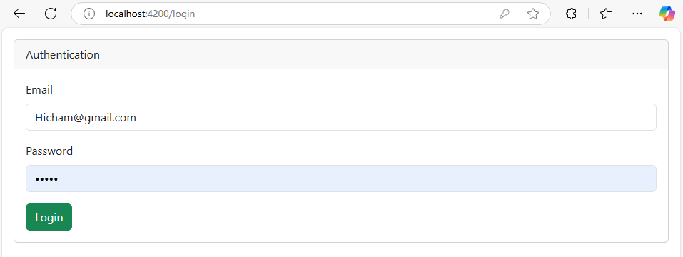
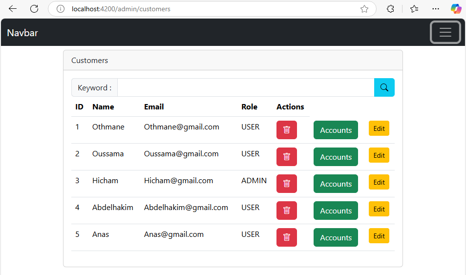
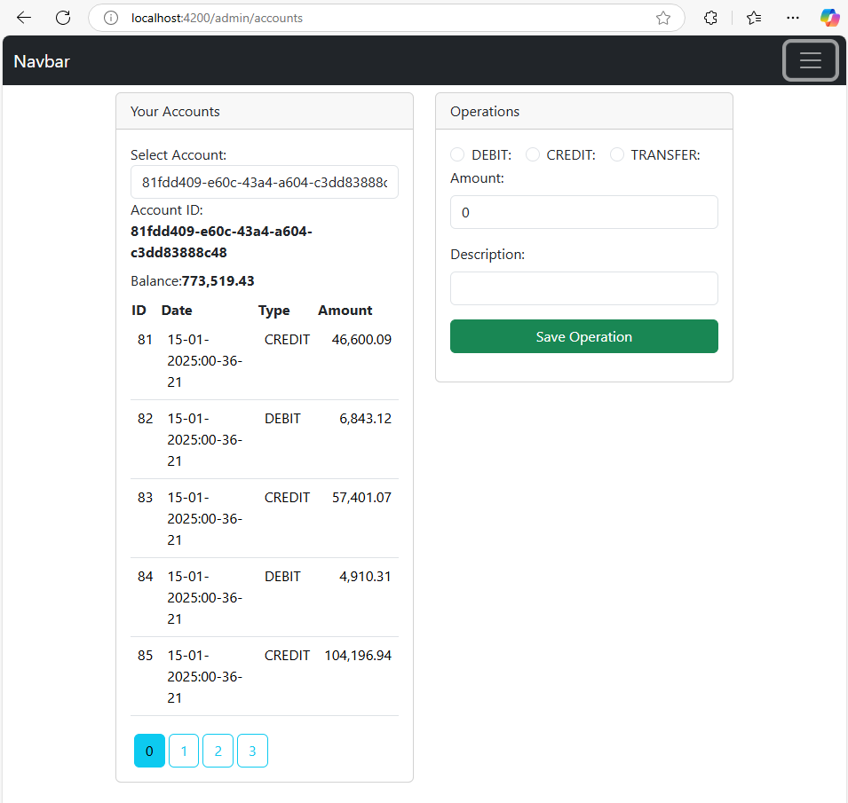
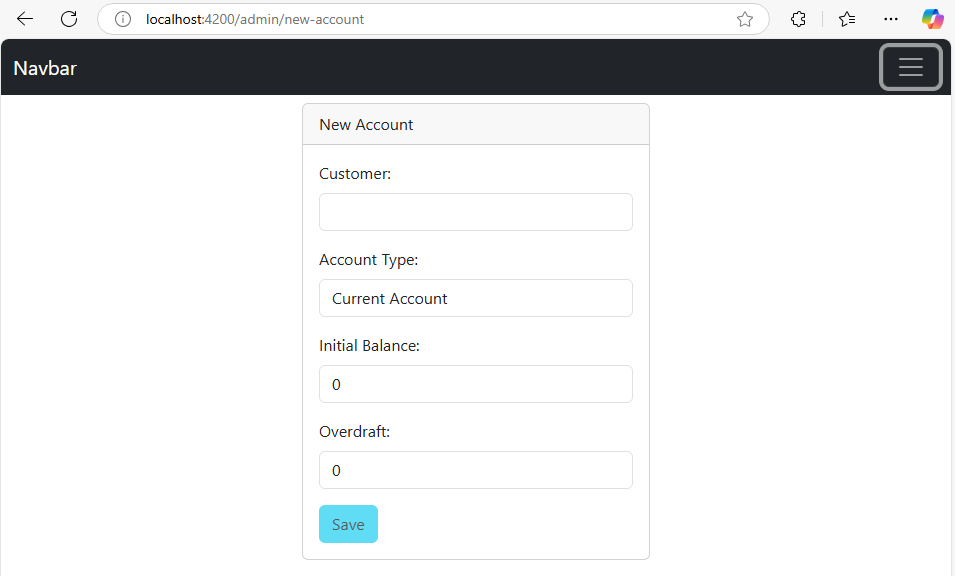
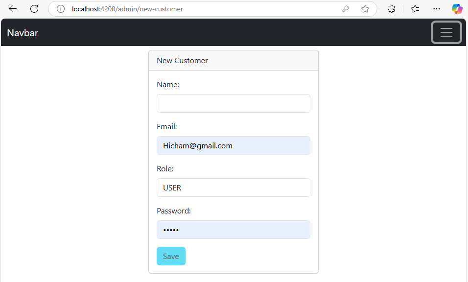
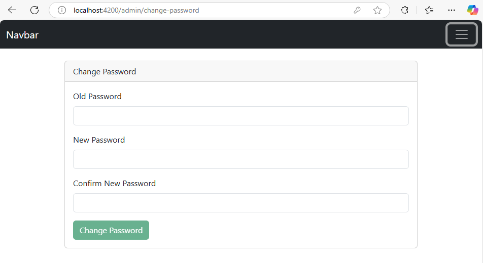

# E-Bank Frontend - Angular Application

This is the frontend application for the E-Bank system, built using Angular. It provides a user-friendly interface for managing customers, bank accounts, and account operations such as debit, credit, and transfer. The application integrates with a backend API (built with Spring Boot) and uses JWT (JSON Web Tokens) for secure authentication and authorization.

## Features

### Customer Management:
- View, search, and delete customers.
- Create new customers and edit existing ones.
- View customer accounts and perform operations.

### Bank Account Management:
- Create new current or savings accounts.
- View account details and transaction history.
- Perform debit, credit, and transfer operations.

### Authentication and Authorization:
- Secure login with JWT.
- Role-based access control (ROLE_ADMIN and ROLE_USER).
- Change password functionality.

### User-Friendly Interface:
- Responsive design with Bootstrap.
- Pagination for account operations.
- Real-time updates for account balances and transactions.

## Technologies Used
- **Angular**: Frontend framework for building the application.
- **Bootstrap**: For responsive and modern UI components.
- **RxJS**: For handling asynchronous operations and API calls.
- **JWT (JSON Web Tokens)**: For secure authentication.
- **Angular Router**: For navigation and route protection.
- **Angular Forms**: For handling form inputs and validations.
- **Angular HTTP Client**: For making API requests to the backend.

## Installation

### Prerequisites
1. **Node.js**: Ensure you have Node.js installed (version 16 or higher).
2. **Angular CLI**: Install Angular CLI globally using the following command:
   ```bash
   npm install -g @angular/cli
   ```

### Steps to Run the Project

1. Clone the Repository:
   ```bash
   git clone https://github.com/your-repo/e-bank-frontend.git
   cd e-bank-frontend
   ```

2. Install Dependencies:
   ```bash
   npm install
   ```

3. Configure the Backend API:
   Update the `environment.ts` file with the backend API URL:
   ```typescript
   export const environment = {
     production: false,
     backendUrl: 'http://localhost:8080' // Replace with your backend URL
   };
   ```

4. Run the Application:
   ```bash
   ng serve
   ```
   The application will be available at [http://localhost:4200](http://localhost:4200).

## Project Structure

### Key Components
- **Navbar Component**:
  - Displays navigation links based on the user's role (ROLE_ADMIN or ROLE_USER).
  - Allows users to log out and change their password.
- **Login Component**:
  - Handles user authentication using JWT.
  - Redirects users to the dashboard after successful login.
- **Accounts Component**:
  - Displays the user's accounts and allows them to view transaction history.
  - Enables users to perform debit, credit, and transfer operations.
- **Customers Component**:
  - Allows admins to view, search, and delete customers.
  - Provides options to create new customers and edit existing ones.
- **New Account Component**:
  - Allows admins to create new current or savings accounts for customers.
- **Change Password Component**:
  - Allows users to change their password securely.
- **My Accounts Component**:
  - Displays the logged-in user's accounts and their transaction history.

### Services
- **AuthService**:
  - Handles user authentication, JWT token management, and role-based access control.
- **AccountsService**:
  - Provides methods to interact with the backend API for account-related operations.
- **CustomerService**:
  - Provides methods to interact with the backend API for customer-related operations.

### Guards
- **AuthenticationGuard**:
  - Protects routes and ensures only authenticated users can access them.
- **AuthorizationGuard**:
  - Ensures that only users with specific roles (ROLE_ADMIN or ROLE_USER) can access certain routes.

### Models
- **Customer Model**:
  - Represents a customer with properties like id, name, email, and role.
- **BankAccountDTO**:
  - Represents a bank account with properties like id, balance, type, and status.
- **AccountDetails**:
  - Represents account details, including transaction history.

## Screenshots

Here are some screenshots of the E-Bank application:

### Login Page


### Customer List


### Account Lists


### Account creation


### Creation of customers


### Password Reset


## Usage

### Navigate to the login page and enter your email and password.
- After successful login, you will be redirected to the dashboard.

### Manage Customers (Admin Only)
- Admins can view, search, and delete customers.
- Admins can create new customers and edit existing ones.

### Manage Accounts
- Admins can create new current or savings accounts for customers.
- Users can view their accounts and perform debit, credit, and transfer operations.

### Change Password
- Users can change their password by navigating to the "Change Password" page.

## Backend Repository

The backend for this project is hosted in a separate repository. You can find it here:

[E-Bank Backend Repository](https://github.com/HAJJIRI-OUSSAMA/Secure_EBANK_Backend)

## License
This project is licensed under the MIT License. See the LICENSE file for details.

## Acknowledgments
- Angular and Bootstrap for providing the tools to build this application.
- Spring Boot for the robust backend API.
- JWT for secure authentication and authorization.
